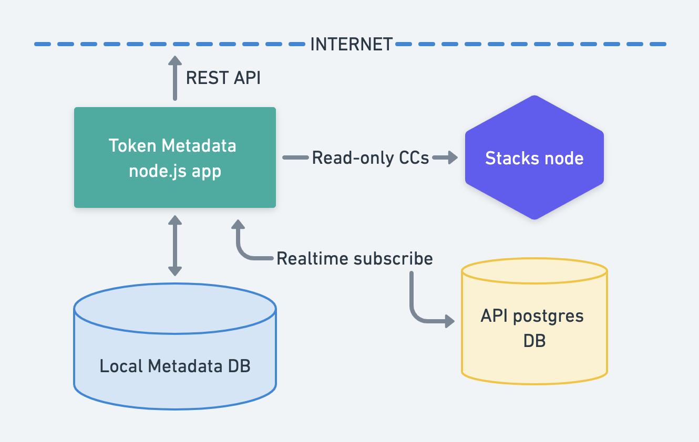
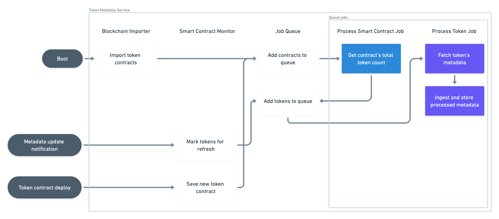

# Stacks Token Metadata Service

A microservice that indexes metadata for all Fungible, Non-Fungible, and Semi-Fungible Tokens in the
Stacks blockchain and exposes it via JSON REST API endpoints.

## Table of Contents

* [Features](#features)
* [API reference](#api-reference)
* [Quick start](#quick-start)
    * [System requirements](#system-requirements)
    * [Running the service](#running-the-service)
    * [Using an image cache service](#using-an-image-cache-service)
* [Service architecture](#service-architecture)
    * [External](#external)
    * [Internal](#internal)
        * [Blockchain importer](#smart-contract-importer)
        * [Smart Contract Monitor](#smart-contract-monitor)
        * [Job Queue](#job-queue)
            * [Process Smart Contract Job](#process-smart-contract-job)
            * [Process Token Job](#process-token-job)

## Features

* Complete
  [SIP-016](https://github.com/stacksgov/sips/blob/main/sips/sip-016/sip-016-token-metadata.md)
  metadata ingestion for
    * [SIP-009](https://github.com/stacksgov/sips/blob/main/sips/sip-009/sip-009-nft-standard.md)
      Non-Fungible Tokens
    * [SIP-010](https://github.com/stacksgov/sips/blob/main/sips/sip-010/sip-010-fungible-token-standard.md)
      Fungible Tokens
    * [SIP-013](https://github.com/stacksgov/sips/blob/main/sips/sip-013/sip-013-semi-fungible-token-standard.md)
      Semi-Fungible Tokens
* Automatic metadata refreshes via [SIP-019](https://github.com/stacksgov/sips/pull/72)
  notifications
* Metadata localization support
* Metadata fetching via `http:`, `https:`, `data:` URIs. Also supported via customizable gateways:
    * IPFS
    * Arweave
* Easy to use REST JSON endpoints with ETag caching
* Prometheus metrics for job queue status, contract and token counts, API performance, etc.
* Image cache/CDN support

## API reference

See the [Token Metadata Service API Reference]() for more information.

## Quick start

### System requirements

The Token Metadata Service is a microservice that has hard dependencies on other Stacks blockchain
components. Before you start, you'll need to have access to:

1. A fully synchronized [Stacks node](https://github.com/stacks-network/stacks-blockchain)
1. A fully synchronized instance of the [Stacks Blockchain
API](https://github.com/hirosystems/stacks-blockchain-api) running in `default` or `write-only`
mode, with its Postgres database exposed for new connections. A read-only DB replica is also
acceptable.
1. A local writeable Postgres database for token metadata storage

### Running the service

Clone the repo.

Create an `.env` file and specify the appropriate values to configure access to the Stacks API
database, the Token Metadata Service local database, and the Stacks node RPC interface. See
[`env.ts`](https://github.com/hirosystems/token-metadata-service/blob/develop/src/env.ts) for all
available configuration options.

Build the app (NodeJS v18+ is required)
```
npm install
npm run build
```

Start the service
```
npm run start
```

### Stopping the service

When shutting down, you should always prefer to send the `SIGINT` signal instead of `SIGKILL` so
the service has time to finish any pending background work and all dependencies are gracefully
disconnected.

### Using an image cache service

The Token Metadata Service allows you to specify the path to a custom script that can pre-process
every image URL detected by the service before it's inserted into the DB. This allows you to serve
CDN image URLs in your metadata responses instead of raw URLs, providing key advantages such as:

* Improves image load speed
* Increases reliability in case original image becomes unavailable
* Protects original image hosts from DDoS attacks
* Increases user privacy
* etc.

An example IMGIX processor script is included in
[`config/image-cache.js`](https://github.com/hirosystems/token-metadata-service/blob/develop/config/image-cache.js).
You can customize the script path by altering the `METADATA_IMAGE_CACHE_PROCESSOR` environment
variable.

## Service architecture

### External



The Stacks Token Metadata Service connects to three different systems to operate:

1. A Stacks Blockchain API database to import all historical smart contracts when booting up, and to
   listen for new contracts that may be deployed. Read-only access is recommended as this service
   will never need to write anything to this DB.
1. A Stacks node to respond to all read-only contract calls required when fetching token metadata
   (calls to get token count, token metadata URIs, etc.)
1. A local Postgres DB to store all processed metadata info

The service will also need to fetch external metadata files (JSONs, images) from the Internet, so it
must have access to external networks.

### Internal



#### Blockchain importer

The
[`BlockchainImporter`](https://github.com/hirosystems/token-metadata-service/blob/develop/src/token-processor/blockchain-api/blockchain-importer.ts)
component is only used on service boot.

It connects to the Stacks Blockchain API database and scans the entire `smart_contracts` table
looking for any contract that conforms to SIP-009, SIP-010 or SIP-013. When it finds a token
contract, it creates a
[`ProcessSmartContractJob`](https://github.com/hirosystems/token-metadata-service/blob/develop/src/token-processor/process-smart-contract-job.ts)
job and adds it to the [Job queue](#job-queue) so its tokens can be read and processed thereafter.

This process is only run once. If the Token Metadata Service is ever restarted, though, this
component re-scans the API `smart_contracts` table from the last processed block height so it can
pick up any newer contracts it might have missed while the service was unavailable.

#### Smart Contract Monitor

The
[`BlockchainSmartContractMonitor`](https://github.com/hirosystems/token-metadata-service/blob/develop/src/token-processor/blockchain-api/blockchain-smart-contract-monitor.ts)
component constantly listens for the following Stacks Blockchain API events:

* **Smart contract log events**

    If a contract `print` event conforms to SIP-019, it finds the affected tokens and marks them for
    metadata refresh.

* **Smart contract deployments**

    If the new contract is a token contract, it saves it and enqueues it for token processing.

This process is kept alive throughout the entire service lifetime.

#### Job Queue

The role of the
[`JobQueue`](https://github.com/hirosystems/token-metadata-service/blob/develop/src/token-processor/queue/job-queue.ts)
is to perform all the smart contract and token processing in the service.

It is a priority queue that organizes all necessary work for contract ingestion and token metadata
processing. Every job processed by this queue corresponds to one row in the `jobs` DB table, which
marks its processing status and related objects to be worked on (smart contract or token).

This object essentially runs an infinite loop that follows these steps:
1. Upon `start()`, it fetches a set number of job rows that are `'pending'` and loads their
   corresponding `Job` objects into memory for processing, marking those rows now as `'queued'`.
2. It executes each loaded job to completion concurrently. Depending on success or failure, the job
   row is marked as either `'done'` or `'failed'`.
3. Once all loaded jobs are done (and the queue is now empty), it goes back to step 1.

There are two env vars that can help you tune how the queue performs:
* `ENV.JOB_QUEUE_SIZE_LIMIT`: The in-memory size of the queue, i.e. the number of pending jobs that
   are loaded from the database while they wait for execution (see step 1 above).
* `ENV.JOB_QUEUE_CONCURRENCY_LIMIT`: The number of jobs that will be ran simultaneously.

This queue runs continuously and can handle an unlimited number of jobs.

##### Process Smart Contract Job

This job makes a contract call to the Stacks node in order to determine the total number of tokens
declared by the given contract. Once determined, it creates and enqueues all of these tokens for
metadata ingestion.

##### Process Token Job

This job fetches the metadata JSON object for a single token as well as other relevant properties
depending on the token type (symbol, decimals, etc.). Once fetched, it parses and ingests this data
to save it into the local database for API endpoints to return.

If a `429` (Too Many Requests) status code is returned by a hostname used to fetch metadata, the
service will cease all further requests to it until a reasonable amount of time has passed or until
the time specified by the host in a `Retry-After` response header.
